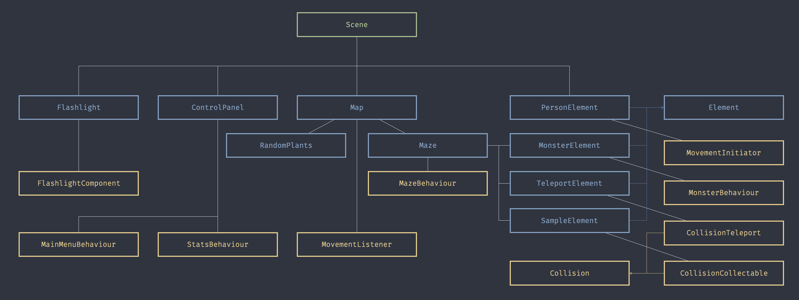

# NI-APH Semester work

- Game: The Lab
- Author: Sergey Dunaevskiy
- Semester: ZS 2020
- https://dunaeser-ni-aph.netlify.app/

## Install & Run

- yarn is required (npm does not work because of workspaces) 

```
yarn install 

yarn start   # development server
# OR
yarn bundle  # production build
```

## Game architecture

Main hierarchy:
- Lifecycle is taken from ECS library (see `./libs/pixi-ecs`)
- Green is a Scene
- Blue are Entities
- Yellow are Components




## Description

Endless game (except death). 
A person (doctor) is placed into a lab and needs to collect samples to receive a high score.

- [W][A][S][D] - movement
